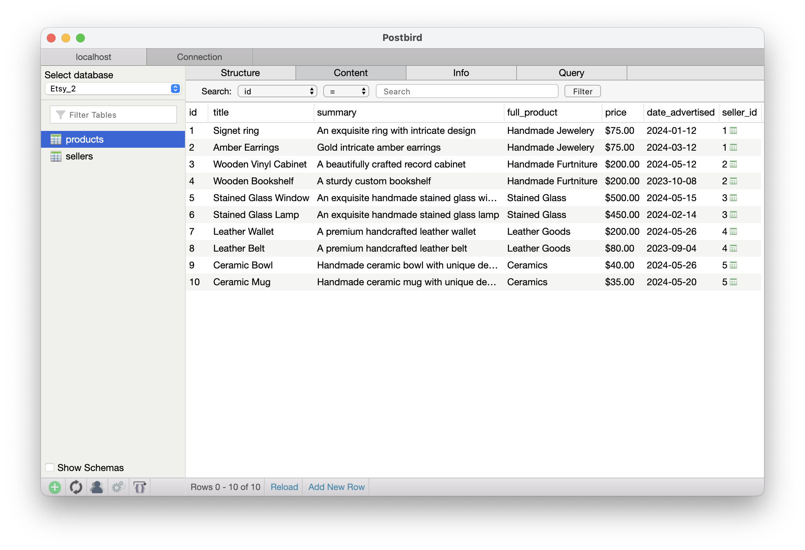

# TechNative PostgreSQL Database Design Challenge

This project involved designing two unique databases for:

- The Guardian 2 (a blog databse storing information on authors and blog posts)
- Etsy 2 (an e-commerce store database storing information on sellers and products)

## Project Overview

Part one and part two of this project required:

- Setting up a PostgreSQL database
- Designing and creating tables using SQL in Postbird
- Specifying data types
- Specifying constraints (e.g. primary keys, foreign keys, unique constraints)
- Defining relationships (one to many, many to many)
- Inserting sample data
- Querying information using SQL

## Screenshots

### Guardian 2 authors table:

Example query:

`List all sellers, and a count of how many products they have:`

### Etsy 2 Sellers table:

### Etsy 2 Products table:

